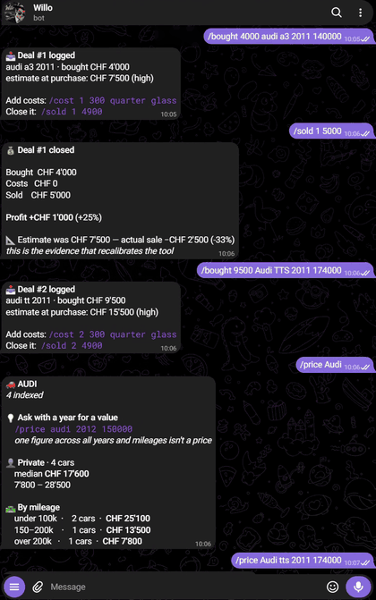

# SwissCarScout



A Telegram bot and market index for flipping used cars in Switzerland.

The arbitrage is simple: private sellers who underprice mechanically sound cars
because they don't know the market. The tool indexes AutoScout24 for real price
data, and you paste listings to the bot — from tutti saved-search emails,
Facebook Marketplace, word of mouth — and it measures each one against what
comparable cars actually sell for privately in Switzerland.

**What it does in one sentence:** paste a car, get a scored verdict and a market
comparison; `/price audi a3 2011 150000` for the full private-vs-dealer
breakdown.

---

## How it works

**Market index** — AutoScout24 is indexed nightly in price bands (CHF 1,500–30,000),
rotating through 19 bands so the full range is covered every five nights. Each
listing stores make, model, year, mileage, seller type and price. 20,000+ cars
after a full cycle.

**Price estimate** — one function (`db.estimate()`) used by scoring, `/price`,
`/deal` and the ledger. It takes the median of cars in the same year window and
mileage bucket, widening only when data is thin and refusing to print a number
when the dealer and private samples don't line up. There used to be three
separate functions that disagreed; that produced a CHF 4,200 gap on the same car.

**Scoring** — a listing is scored as a buy or broker lead. The market comparison
is measured data. The keyword weights (urgency, stale listing, MFK signals) are
configurable and labelled as guesses until your ledger calibrates them.

**Ledger** — `/bought` snapshots the estimate at purchase. `/sold` records what it
actually fetched. `/ledger` reports how far off the estimates were, and after four
or more sales tells you which way to move the discount factor.

---

## Setup

### What you need

- A Linux VPS (tested on Ubuntu 24 / Oracle Cloud free tier)
- A Telegram bot token from [@BotFather](https://t.me/BotFather)
- Optionally: a [Gemini API key](https://aistudio.google.com/apikey) (free tier) for better text extraction and photo analysis

### Install

```bash
git clone https://github.com/yourusername/SwissCarScout.git
cd SwissCarScout
./deploy/install.sh
```

The install script builds a virtualenv, installs the two dependencies
(`requests`, `PyYAML`), creates `.env` from the template and runs an offline
self-test.

### Configure

```bash
nano .env
```

```
TG_TOKEN=your_bot_token
TG_CHAT=your_chat_id        # message your bot, then GET /getUpdates
GEMINI_API_KEY=optional_but_recommended
```

```bash
nano config.yaml
```

The defaults are reasonable. The one thing to set before running is the
AutoScout24 index range — `index.price_from` and `index.price_to` — which
defaults to CHF 1,500–30,000.

### Smoke test

```bash
set -a; source .env; set +a
.venv/bin/python run.py --source sample --mode broker   # 4 leads on your phone
.venv/bin/python run.py --source autoscout24 --probe    # HTTP 200, 3 real cars
```

### Build the price baseline

```bash
.venv/bin/python run.py --source autoscout24 --index
```

~2,400 cars, ~10 minutes. A Telegram report arrives when it finishes. The first
run will show few models priced — it needs five private comparables per model.
After 4–5 nightly runs you have a usable baseline across the full market.

### Install services

```bash
sudo cp deploy/swisscarscout-listen.service deploy/swisscarscout-index.{service,timer} /etc/systemd/system/
sudo systemctl daemon-reload
sudo systemctl enable --now swisscarscout-listen swisscarscout-index.timer
```

`swisscarscout-listen` stays running and receives listings you paste to the bot.
`swisscarscout-index` runs nightly at 03:20 via the timer.

---

## Telegram commands

### Market prices

| Command | What it does |
|---|---|
| `/price audi a3` | Spread by year and mileage bucket |
| `/price audi a3 2011` | Narrowed to that year ±3 |
| `/price audi a3 2011 150000` | The number you actually want |
| `/models` | Which models have enough data |

`/price` without a year shows the distribution and asks you to narrow it —
a single figure across all years isn't a price.

Ambiguous queries get tappable buttons, not text links (text links send a bare
`/price` and trigger an infinite loop).

### Deal workflow

| Command | What it does |
|---|---|
| `/deal 3200 seat leon 2007 121000` | What-if: resale, costs, margin, max to pay |
| `/bought 3200 seat leon 2007 121000` | Log a purchase |
| `/cost 1 300 quarter glass` | Add a repair to deal #1 |
| `/sold 1 4900` | Close it, see real profit |
| `/ledger` | Positions, P&L, estimate accuracy |

### Settings

| Command | What it does |
|---|---|
| `/budget 5200` | Buy ceiling |
| `/range 2200 5800` | Price window |
| `/threshold buy 6` | Alert score |
| `/stale 40` | Days before a listing is stale |
| `/show` / `/reset` | Current settings / back to defaults |

Settings are stored in the database, not written back to `config.yaml`, so
`/reset` genuinely resets and the file keeps its comments.

---

## Pasting listings

Send the bot any advert text — Facebook Marketplace, tutti, anything. With a
Gemini key it extracts make, model, year, mileage, MFK date, region, price and
stated red flags. Without one it uses a regex fallback.

Send photos (or photos with the advert as caption) and it reports what is
actually visible: rust location, panel gaps, tyre condition, warning lights,
odometer vs interior wear, anything in the boot. Each finding is labelled
**cosmetic** (a negotiating lever) or **structural** (walk away). Albums are
batched so all five photos from one Facebook post arrive together.

Chat messages that are too short or contain no car-related terms are rejected
before they touch the database.

---

## Data sources

| Source | Role | Status |
|---|---|---|
| AutoScout24 | Price index only — dealer inventory at retail, not deal flow | ✅ Active |
| tutti.ch | Blocked from VPS (Cloudflare, datacenter IP) | ❌ Use native saved-search emails |
| Facebook Marketplace | Anti-bot measures, account-ban risk | ❌ Paste manually |
| Manual / paste | Any car you find by hand | ✅ Via bot or `manual.yaml` |

**Sourcing is not solved.** The tool prices cars you find; it doesn't find them.
Set up tutti's saved-search email alerts ("Enregistrer la recherche") and
Facebook's saved-search notifications. When something looks interesting, paste
it to the bot.

---

## Architecture

```
radar/
  sources/
    autoscout24.py   POST api.autoscout24.ch/v1/listings/search
    tutti.py         reads __NEXT_DATA__ from tutti.ch search pages (blocked from VPS)
    manual.py        manual.yaml or pasted listings
    base.py          Source base class
  db.py              SQLite, WAL mode, migrations, db.estimate()
  bands.py           price-band rotation for the index
  lookup.py          /price fuzzy matching and report rendering
  scoring.py         buy / broker scoring
  ledger.py          /bought /cost /sold /ledger
  intake.py          Telegram listener, photo analysis, command dispatch
  ai.py              Gemini: text extraction and photo inspection
  settings.py        bot-settable runtime overrides (stored in DB)
  paste.py           regex fallback parser for --paste CLI
  models.py          Listing dataclass, MAKES set
  notify.py          Telegram send
run.py               CLI entry point (--listen, --index, --probe, --explain, ...)
tests/test_core.py   19 regression tests
```

**Two dependencies:** `requests` and `PyYAML`. Every marketplace adapter is
implemented in this repository rather than pulled from a third-party scraper
package — one less thing to break when a site changes.

---

## Tests

```bash
python -m unittest discover -s tests -v
```

19 tests, standard library only. Every test pins a bug that actually shipped,
named for it:

- Mileage normalisation sign was inverted (inflated baselines for high-km cars)
- Three price functions disagreed (CHF 4,200 gap on the same car)
- Pasted cars counted as comparables (selection bias)
- Hunt ran a 3-day expiry that mass-marked indexed cars as sold
- `/price bmw 320` offered itself as an ambiguity option (infinite loop)
- Dead command links triggered infinite loop from `/price` usage text
- Indexes ran before migrations on upgrade (crash)

---

## Honest notes

**The market data is real.** 20,000+ listings with structured make, model, year,
mileage, seller type and price. The price estimates are measured, not modelled.
The sold/delisted data (cars that disappeared from listings) is the most valuable
column — it is closer to what actually cleared than any asking price.

**The scoring weights are guesses.** "muss weg" = +4, stale = +3, threshold 6.0
— none of that is calibrated against anything. The ledger exists to fix this.
After four or five real sales it will tell you which numbers to trust and which
to adjust.

**The sourcing problem is not solved.** The tool prices cars you find by hand.
Finding them is a separate problem, and the answer for Switzerland right now is
tutti saved-search emails and Facebook notifications.

---

## License

MIT
